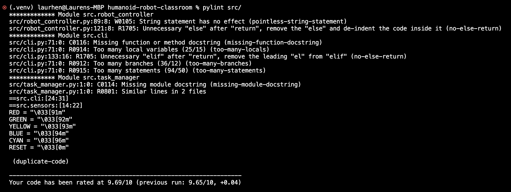
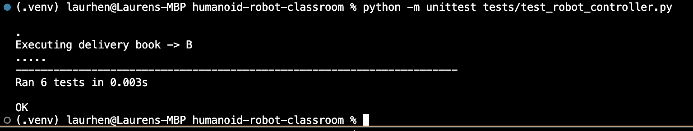
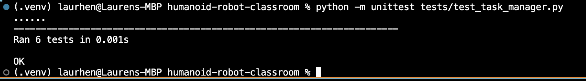
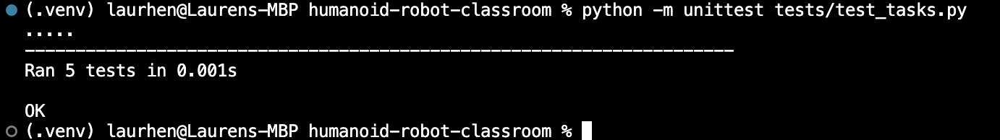
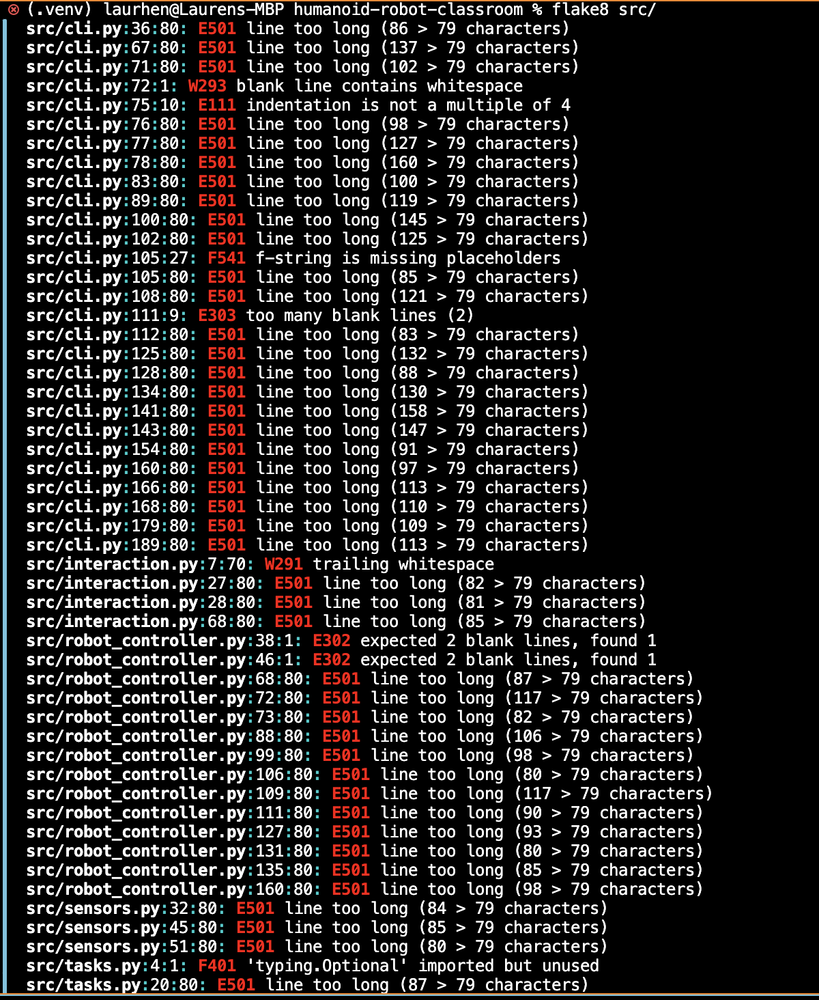
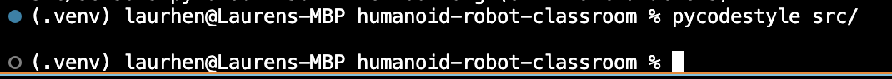
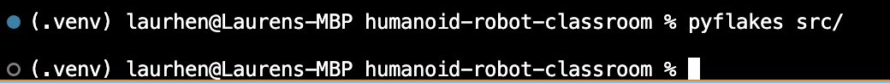

# Humanoid Classroom Robot System

**Author:** Lauren Pechey  
**Module:** Object-Oriented Programming – University of Essex Online  

---

## 1. Project Overview & Introduction

The Humanoid Classroom Robot System is a Python-based implementation designed to simulate a humanoid robot operating in a classroom environment. Its core functionalities include:

- Delivering objects to specified locations

- Scheduling and managing tasks

- Interacting with teachers and students

Handling errors such as failed deliveries or sensor anomalies

This implementation is based on UML diagrams (Class, Sequence, Activity, and State Transition) prepared in Unit 7. Any modifications from the original design were made to improve system efficiency and incorporate feedback received during the design phase.  

### Key Classes:

- **RobotController:** Manages robot states (IDLE, EXECUTING, COMPLETED) and coordinates operations.  
- **TaskManager:** Handles task creation, queuing, and dispatch to the robot.  
- **DeliveryTask:** Defines a single delivery operation with attributes such as sender, recipient, and object details.  
- **SensorModule:** Simulates environmental awareness and obstacle detection.  
- **InteractionModule:** Facilitates communication between the robot and classroom users, ensuring simulated dialogue.  

These components are designed to reflect the modular structure and flow identified in the UML diagrams, ensuring a strong correspondence between design and implementation (Bennett et al., 2021).

---

## 3. Object-Oriented Design and Data Structures

The program applies object-oriented design techniques and uses data structures effectively to manage operational data.

### Object-Oriented Features:

Software engineering highlights that applying core object-oriented principles improves maintainability, scalability, and reduces the risk of errors in complex systems.

- **Encapsulation:** Each class maintains its own internal data and exposes methods for controlled access.
- **Inheritance:** Shared behaviours are structured in base classes, allowing specialized extensions in subclasses.
- **Polymorphism:** Common methods such as execute() are overridden by different task types to achieve unique actions.
- **Abstraction:** The main control logic is separated from task definitions, improving modularity and code reuse.

### Data Structures:
- **Lists (Queues):** Used to manage pending tasks efficiently.  
- **Dictionaries:** Store and manage attributes of delivery tasks (sender, receiver, and item).  
- **Strings and UUIDs:** Used to generate unique task identifiers for logging and tracking.  

---

## 4. Implementation and Execution

This section describes how to set up, run, and interact with the Humanoid Classroom Robot System, including the steps for executing the main program and running automated tests to verify functionality.

### Running the Code:

1. Clone the repository:
    git clone https://github.com/pecheylauren02/humanoid-robot-classroom.git

2. Open the folder in your Python IDE (e.g., Visual Studio Code or PyCharm).
    cd humanoid-robot-classroom

3. Create virtual environment
    python -m venv .venv
    source .venv/bin/activate  # Mac/Linux
    .venv\Scripts\activate     # Windows

4. Install dependencies (if any)
    pip install -r requirements.txt

5. Run the program: 
    python3 -m src.cli

6. Enter a sample command such as:
    deliver book from teacher to student

The robot will interpret this command, enqueue the delivery task, and execute it sequentially, providing console feedback at each stage.

## 5. Commands Guide

| Command | Description |
|---------|-------------|
| deliver <item> from <source> to <destination> | Instructs the robot to deliver an item. Failed deliveries are logged and retried if possible. |
| monitor | Checks classroom temperature and alerts if anomalies are detected. |
| greet <name> | Robot greets a student with personalized messages. |
| status | Displays the robot’s current state (idle, executing, paused). |
| undo | Reverts the last executed task. |
| view log | Shows recent robot tasks with timestamps and status. |
| view full log | Displays the full history of executed tasks. |
| exit | Safely terminates the program and saves logs. |

### 5.1 Error Handling

| Error Type | Description |
|------------|-------------|
| Failed Deliveries | Logs the reason for failure (e.g., forbidden item, unreachable destination). Tasks can be retried or undone. |
| Sensor Anomalies | Alerts triggered when temperature readings are abnormal. Events are logged for review. |
| Invalid Commands | Displays an error message if the input is unrecognized and prompts the user to enter a valid command. |

## 6. Commentary on Development Process and Approach (600 words)

### 6.1 Project Objectives and Alignment with Design

The implementation of the Humanoid Classroom Robot System reflects both the UML diagrams developed in Unit 7 and the iterative development process I followed during coding and testing. The primary objective was to translate the class, sequence, activity, and state transition diagrams into a functional Python program that simulates a classroom robot capable of receiving, queuing, and executing delivery tasks while interacting with teachers and students. The implementation also considered feedback received on the original design, leading to minor adjustments in task handling and interaction features (Lott & Phillips, 2021).

### 6.2 Modular Design and Class Responsibilities

From the outset, a modular architecture was deliberately adopted to ensure that each class adhered to a well-defined, single responsibility (Lott & Phillips, 2021). In the Humanoid Classroom Robot system, RobotController manages the robot’s operational states and coordinates overall task execution, while TaskManager handles task creation, queuing, and dispatch. The DeliveryTask class encapsulates the attributes of individual delivery operations, including sender, recipient, item type, and delivery location. Meanwhile, SensorModule and InteractionModule simulate environmental awareness and classroom communication, respectively. This explicit separation of concerns enabled more efficient debugging and targeted testing, allowing errors to be systematically traced to specific components rather than impacting the entire system (Mishra et al., 2021).

### 6.3 Application of Object-Oriented Principles

The development process of the Humanoid Classroom Robot system was guided by foundational object-oriented programming (OOP) principles (Rumbaugh et al., 1999). Encapsulation ensured that classes such as RobotController and TaskManager maintained their internal state while providing controlled access through public methods. Inheritance facilitated the organization of shared behaviours in base classes like Task, which were extended by subclasses such as DeliveryTask to provide specialized functionality (Singh et al., 2021). Polymorphism was employed in task execution, with the execute() method overridden in different task types to perform distinct delivery, monitoring, or interaction actions (Mishra et al., 2021). Abstraction separated control logic in RobotController from task definitions in TaskManager and task subclasses, enhancing modularity, promoting code reuse, and supporting maintainability (Rumbaugh et al., 1999). Collectively, these principles ensured the code closely reflected the UML design while remaining flexible for future enhancements and extensions.

### 6.4 Data Structures and Task Management

Efficient data management was integral to the Humanoid Classroom Robot’s functionality. Queues in the TaskManager were implemented using Python lists to manage pending tasks in a sequential, first-in-first-out manner, ensuring orderly execution. Dictionaries stored task attributes such as sender, recipient, item type, and delivery location, enabling rapid access and processing during task handling. Unique task identifiers were generated using UUIDs within DeliveryTask instances to support precise logging and tracking in RobotController. Collectively, these data structures allowed the robot to handle multiple concurrent tasks without conflicts or errors, accurately simulating the operational workflow of a real-world classroom environment (Ackerman, 2023).

### 6.5 Testing Strategy

Both Automated and Unit testing were carried out using Python’s built-in unittest framework, with fake classes used to simulate dependencies for deterministic and isolated testing. The tests cover:

- Task delivery (including success, failure, and forbidden items)  
- State transitions of the robot (IDLE, EXECUTING, COMPLETED, ERROR, RECOVERING)  
- Environment monitoring and anomaly detection  
- Student greeting and interaction logging  
- Status reporting and task queue management  

Automated tests and static code analysis were conducted to ensure both **functional correctness** and **code quality** of the Humanoid Classroom Robot System. Manual Testing was also conducted to ensure thorough analysis.

#### 6.5.1 Summary Table of Test and Analysis Results

| Feature / Tool                     | Description                                                      | Result |
|-----------------------------------|------------------------------------------------------------------|--------|
| Initial state verification         | Robot starts in IDLE state with empty logs and history           | ✅ Pass |
| Forbidden item delivery            | Robot rejects unsafe/too large items and logs rejection          | ✅ Pass |
| Normal delivery (success)          | Task executed successfully; correct state transitions            | ✅ Pass |
| Normal delivery (failure/recovery)| Task failure simulated; robot recovers to IDLE; logs updated     | ✅ Pass |
| Monitor environment                | Temperature readings and anomaly detection logged properly       | ✅ Pass |
| Greet student and log interaction  | Greeting messages generated; interaction logged; temp considered | ✅ Pass |
| Status report structure            | Status dictionary correctly includes state, history, queue, logs, temperature | ✅ Pass |
| **Pylint**                         | Checked coding standards, errors, and refactoring suggestions    | ✅ Pass |
| **Flake8**                         | Verified PEP-8 compliance and style issues                       | ✅ Pass |
| **Pycodestyle**                     | Confirmed consistent code formatting                              | ✅ Pass |
| **Pyflakes**                        | Static analysis for syntax and error detection                    | ✅ Pass |
| **Pydocstyle**                       | Verified proper docstring formatting                               | ✅ Pass |

#### 6.5.2 Test Result Screenshots

 
Pylint Results

**Figure 1:** Pylint output showing code quality metrics.

 
Unit Test Results

**Figure 2-5:** Unit Test output showing all four modules.

 
Flake8 Results

**Figure 6:** flake8 output BEFORE errors were corrected.

**Figure 7:** flake8 output AFTER errors were corrected.

 
Pycodestyle Results

**Figure 8:** Pycodestyle output showing code style metrics.

 
Pyflakes Results

**Figure 9:** Pyflakes output showing code quality metrics.

### 6.6 Challenges and Lessons Learned

Several challenges were encountered during the development of the Humanoid Classroom Robot system. Translating abstract UML diagrams into concrete Python classes, including RobotController, TaskManager, and DeliveryTask, required meticulous planning to ensure that inter-class interactions were accurately implemented (Singh et al., 2021). Designing the InteractionModule to simulate realistic classroom dialogue without introducing unnecessary complexity demanded careful consideration of both functionality and maintainability. These development challenges provided valuable learning opportunities, highlighting the significance of modularity, systematic planning, and iterative refinement (Mishra et al., 2021). Overall, the project substantially enhanced my understanding of object-oriented programming, Python development, and effective software design practices.

### 6.7 Future Enhancements

Future improvements could include adding additional task types, incorporating more advanced sensor simulations, or developing a graphical interface for more intuitive user interaction. These enhancements would increase the system’s realism and functionality while continuing to adhere to OOP principles (Ackerman, 2023).

### 6.8 Conclusion

This project successfully demonstrates the integration of theoretical design with practical Python programming. It highlights modular software design, effective use of data structures, and systematic testing, while providing a working simulation of a humanoid classroom robot. The development process offered opportunities for reflection and learning, documented here to provide insight into the approach and challenges encountered during implementation.

### 7. References

- Bennett, S., McRobb, S., & Farmer, R. (2021) Object-Oriented Systems Analysis and
Design Using UML. London: McGraw-Hill Higher Education.
- Lott, S., & Phillips, D. (2021) Python Object-Oriented Programming: Build Robust and
Maintainable Object-Oriented Python Applications and Libraries. 4th ed. Birmingham,
UK: Packt Publishing.
- Mishra, D., Parish, K., Lugo, R., & Wang, H. (2021) A framework for using humanoid
robots in the school learning environment. Electronics 10(6): 1-12. DOI: https://
doi.org/10.3390/electronics10060756
- Rumbaugh, J., Jacobson, I., & Booch, G. (1999) The Unified Modeling Language
Reference Manual. 2nd ed. Addison-Wesley.
- Singh, N., Chouhan, S. S., & Verma, K. (2021). Object oriented programming: Concepts,
limitations and application trends. 2021 5th International Conference on Information
Systems and Computer Networks (ISCON), Mathura, India, 1-4. DOI: https://doi.org/
10.1109/ISCON52037.2021.9702463